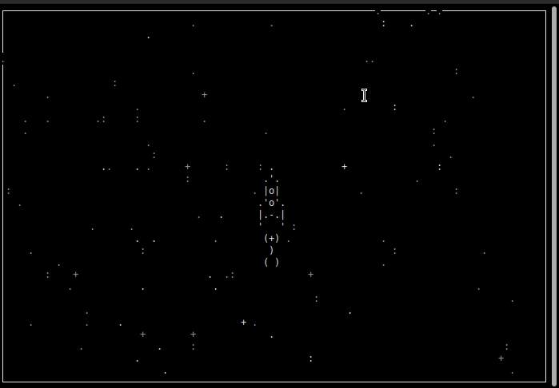

### Game "Star shep"

Project for learn "asyncio".

### Getting Started

Clone repository.

### Run

```commandline
python3 main.py
```

Buttons ```Right Left Up Down``` used for rocket the control.
